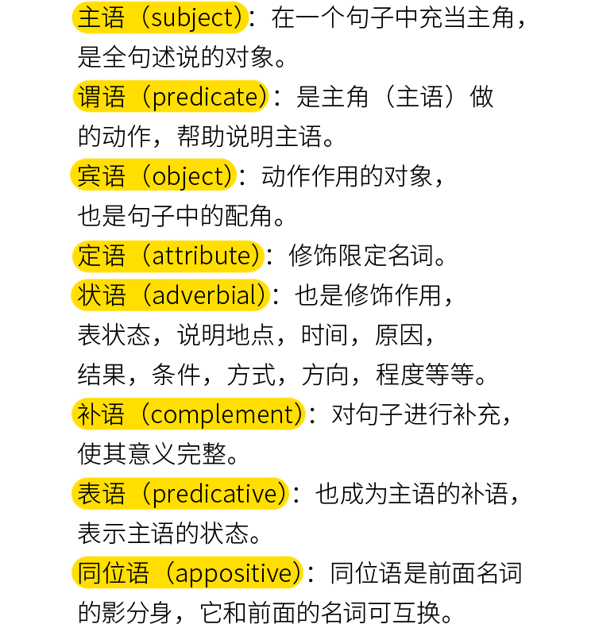

| 句子成分 | 含义 | 例句 | 备注 | 
| --- | --- | --- | --- |
| 主语 | 句子中的 主语 就相当于是主角 | the man | |
| 谓语 | 主语发出的动作 | the man holds | |
| 宾语 | 主语发出动作的承受者/作用对象 | the man holds a girl | |
| 定语 | 句子中修饰主语的，称为定语  | the handsome man with a bell holds a girl | 帅气，带着铃铛，修饰主语，是定语 |
| 状语 | 作修饰，说明地点，时间，原因，结果，条件，方式，方向，程度等 | the handsome man with a bell holds a gril on the boat at dusk |  on the boat:标示地点, at dusk：标示时间 |
| 补语 | 对句子进行补充，使其意义完整 | She let him alone | 宾语补足语。 补语 分为 主语补足语 和 宾语补足语 。主语 的 补语，就是放在 主语 后面的 补足语 ，像我们常说的 表语 ，也是 主语的补语  |
| 表语 | 也称为主语的补语，表示主语的状态 | the other man is a gaofushuai | 主系表，也可以说成 主谓补|
| 同位语 | 同位语 就是两个词语，都是在说同一个人 | zhangwei, is a gaofushuai | |

# 官方定义

