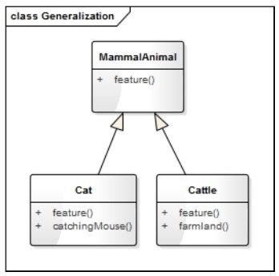
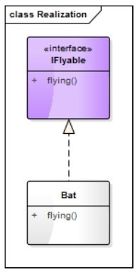
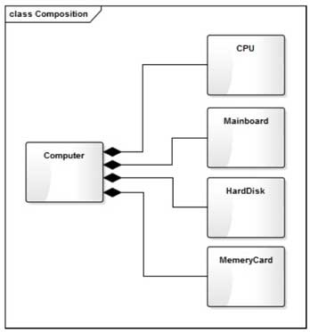
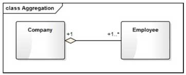
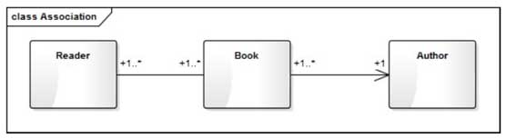
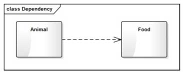

# 1. UML定义
UML是英文 Unified Modeling Language 的缩写，简称UML（统一建模语言），它是一种由一整套图组成的标准化建模语言，用于帮助系统开发人员阐明、设计和构建软件系统。UML 的这一整套图被分为两组，一组叫结构性图，包含类图、组件图、部署图、对象图、包图、组合结构图、轮廓图；一组叫行为性图，包含用例图、活动图（也叫流程图）​、状态机图、序列图、通信图、交互图、时序图。其中类图是应用最广泛的一种图，经常被用于软件架构设计中

# 2. 常见的关系

常见的关系类图用于表示不同的实体（人、事物和数据）​，以及它们彼此之间的关系。该图描述了系统中对象的类型以及它们之间存在的各种静态关系，是一切面向对象方法的核心建模工具。

UML 类图中最常见的几种关系有：泛化（Generalization）​、实现（Realization）​、组合（Composition）​、聚合（Aggregation）​、关联（Association）和依赖（Dependency）​。这些关系的强弱顺序为：泛化=实现 > 组合 > 聚合 > 关联 > 依赖

## 2.1 泛化
泛化（Generalization）是一种继承关系，表示一般与特殊的关系，它指定了子类如何特化父类的所有特征和行为。如：哺乳动物具有恒温、胎生、哺乳等生理特征，猫和牛都是哺乳动物，也都具有这些特征，但除此之外，猫会捉老鼠，牛会耕地

## 2.2 实现
实现（Realization）是一种类与接口的关系，表示类是接口所有特征和行为的实现。如：蝙蝠也是哺乳动物，它除具有哺乳动物的一般特征之外，还会飞，我们可以定义一个IFlyable的接口，表示飞行的动作，而蝙蝠需要实现这个接口

## 2.3 组合

组合（Composition）也表示整体与部分的关系，但部分离开整体后无法单独存在。因此，组合与聚合相比是一种更强的关系

## 2.4 聚合
聚合（Aggregation）是整体与部分的关系，部分可以离开整体而单独存在

## 2.5 关联
关联（Association）是一种拥有关系，它使一个类知道另一个类的属性和方法。关联可以是双向的，也可以是单向的

## 2.6 依赖
依赖（Dependency）是一种使用的关系，即一个类的实现需要另一个类的协助，所以尽量不要使用双向的互相依赖。

