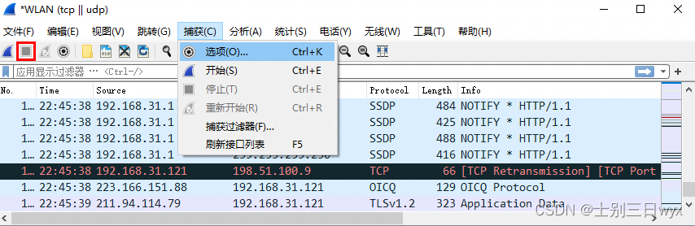
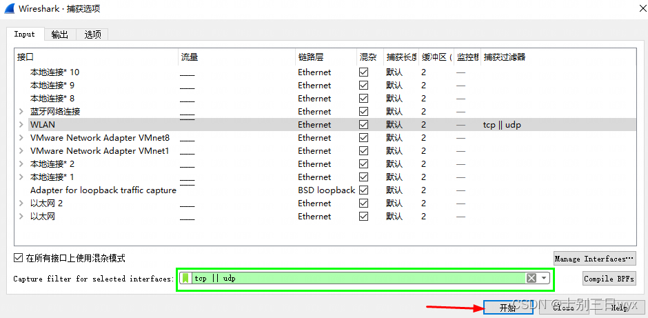
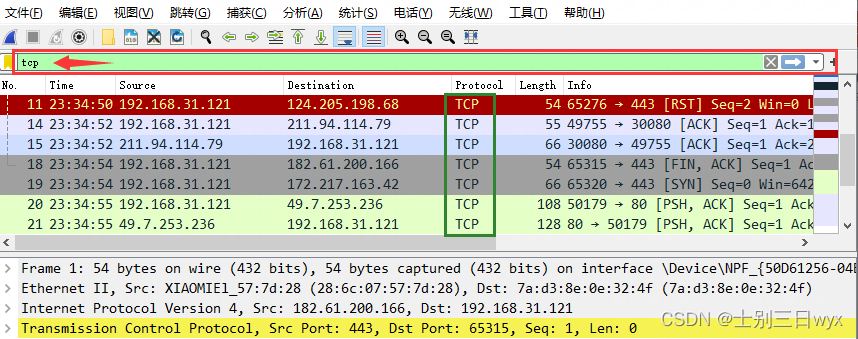

# 一、 过滤器操作
过滤器是Wireshark的核心功能，也是我们平时使用最多的一个功能。

Wireshark提供了两个过滤器：抓包过滤器 和 显示过滤器。两个过滤器的过滤思路不同。

* 抓包过滤器：重点在动作，需要的包我才抓，不需要的我就不抓。
* 显示过滤器：重点在数据的展示，包已经抓了，只是不显示出来。
## 1. 抓包过滤器
抓包过滤器在抓包前使用，它的过滤有一个基本的语法格式：BPF语法格式。

### 1）BPF语法

BPF（全称 Berkeley Packet Filter），中文叫伯克利封包过滤器，它有四个核心元素：类型、方向、协议 和 逻辑运算符。

* 类型Type：主机（host）、网段（net）、端口（port）
* 方向Dir：源地址（src）、目标地址（dst）
* 协议Proto：各种网络协议，比如：tcp、udp、http
* 逻辑运算符：与（ && ）、或（ || ）、非（ ！）

四个元素可以自由组合，比如：

* src host 192.168.31.1：抓取源IP为 192.168.31.1 的数据包
* tcp || udp：抓取 TCP 或者 UDP 协议的数据包

### 2）使用方式
使用抓包过滤器时，需要先停止抓包，设置完过滤规则后，再开始抓包。

停止抓包的前提下，点击工具栏的捕获按钮，点击选项。

在弹出的捕获选项界面，最下方的输入框中输入过滤语句，点击开始即可抓包。

提示：抓包过滤器的输入框，会自动检测语法，绿色代表语法正确，红色代表语法错误。

## 2. 显示过滤器
显示过滤器在抓包后或者抓包的过程中使用。

### 1）语法结构
显示过滤器的语法包含5个核心元素：IP、端口、协议、比较运算符和逻辑运算符。

* IP地址：ip.addr、ip.src、ip.dst
* 端口：tcp.port、tcp.srcport、tcp.dstport
* 协议：tcp、udp、http
* 比较运算符：> < == >= <= !=
* 逻辑运算符：and、or、not、xor（有且仅有一个条件被满足）

5个核心元素可以自由组合，比如：
* ip.addr == 192.168.32.121：显示IP地址为 192.168.32.121 的数据包
* tcp.port == 80 ：显示端口为 80 的数据包

### 2）使用方式
在过滤栏输入过滤语句，修改后立即生效。

提示：过滤栏有自动纠错功能，绿色表示语法正确，红色表示语法错误；

## 转自：https://www.cnblogs.com/yuanyuzhou/p/16308963.html