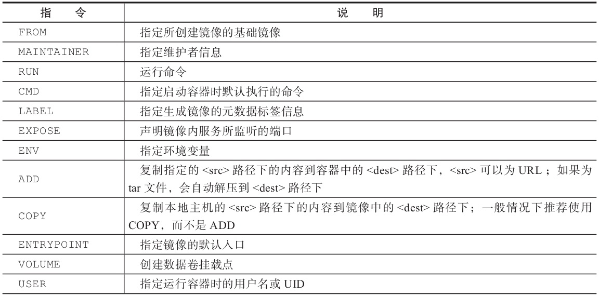
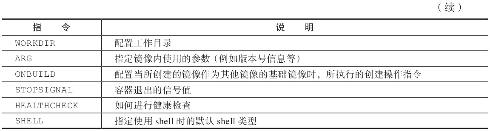

## 一、概括
Dockerfile由一行行命令语句组成，并且支持以#开头的注释行。
一般而言，Dockerfile分为四部分：
* 基础镜像信息、
* 维护者信息、
* 镜像操作指令
* 容器启动时执行指令

```shell
# This Dockerfile uses the ubuntu image
# VERSION 2 - EDITION 1
# Author: docker_user
# Command format: Instruction [arguments / command] ..
# Base image to use, this must be set as the first line
FROM ubuntu
# Maintainer: docker_user <docker_user at email.com> (@docker_user)
MAINTAINER docker_user docker_user@email.com
# Commands to update the image
RUN echo "deb http://archive.ubuntu.com/ubuntu/ raring main universe" >> /etc/apt/
    sources.list
RUN apt-get update && apt-get install -y nginx
RUN echo "\ndaemon off;" >> /etc/nginx/nginx.conf
# Commands when creating a new container
CMD /usr/sbin/nginx
```

其中，一开始必须指明所基于的镜像名称，
接下来一般是说明维护者信息。
后面则是镜像操作指令，例如RUN指令，**RUN指令将对镜像执行跟随的命令。每运行一条RUN指令，镜像就添加新的一层，并提交。**
最后是CMD指令，用来指定运行容器时的操作命令

## 二、 dockerfile 指令说明



### 2.1 FROM
格式为
```shell
FROM<image>
FROM<image>：<tag>
或FROM<image>@<digest>
```
任何Dockerfile中的第一条指令必须为FROM指令。并且，如果在同一个Dockerfile中创建多个镜像，可以使用多个FROM指令（每个镜像一次）。

### 2.2 MAINTAINER
指定维护者信息，格式为MAINTAINER<name>。例如：
```shell
MAINTAINER image_creator@docker.com
```
该信息会写入生成镜像的Author属性域中。

### 2.3 RUN
运行指定指令

格式为
```shell
RUN<command>
# 默认将在shell终端中运行命令，即/bin/sh-c
或RUN["executable"，"param1"，"param2"]
# 使用exec执行，不会启动shell环境
```
> 注意，后一个指令会被解析为Json数组，因此必须用**双引号**。

每条RUN指令将在当前镜像的基础上执行指定命令，并提交为新的镜像。当命令较长时可以使用\来换行。例如
```shell
RUN apt-get update \
        && apt-get install -y libsnappy-dev zlib1g-dev libbz2-dev \
        && rm -rf /var/cache/apt
```
> 减少镜像层数：**如果希望所生成镜像的层数尽量少**，则要尽量合并指令，例如多个**RUN指令可以合并为一条**；

### 2.4 CMD
CMD指令用来指定启动容器时默认执行的命令.
```shell
# 使用exec执行，是推荐使用的方式；
·CMD["executable"，"param1"，"param2"]
# 在/bin/sh中执行，提供给需要交互的应用；
·CMD command param1 param2
# 提供给ENTRYPOINT的默认参数。
·CMD["param1"，"param2"]
```
> **每个Dockerfile只能有一条CMD命令**。如果指定了多条命令，只有最后一条会被执行。

### 2.5 LABEL
LABEL指令用来指定生成镜像的元数据标签信息。
格式为LABEL<key>=<value><key>=<value><key>=<value>...。
例如：
```shell
LABEL version="1.0"
LABEL description="This text illustrates \ that label-values can span multiple lines."

```

### 2.6 EXPOSE
声明镜像内服务所监听的端口。
格式为EXPOSE<port>[<port>...]。
例如：
```shell
EXPOSE 22 80 8443
```
> 注意，该指令只是起到**声明作用，并不会自动完成端口映射**。

### 2.7 ENV

指定环境变量，在镜像生成过程中会被后续RUN指令使用，在镜像启动的容器中也会存在。
格式为ENV<key><value>或ENV<key>=<value>...。
```shell
ENV PG_MAJOR 9.3
ENV PG_VERSION 9.3.4
RUN curl -SL http://example.com/postgres-$PG_VERSION.tar.xz | tar -xJC /usr/src/
    postgress && …
ENV PATH /usr/local/postgres-$PG_MAJOR/bin:$PATH
```
> 指令指定的环境变量在运行时可以被覆盖掉

### 2.8 ADD
该命令将复制指定的<src>路径下的内容到容器中的<dest>路径下。
格式为ADD<src><dest>。
其中<src>可以是Dockerfile所在目录的一个相对路径（文件或目录），也可以是一个URL，还可以是一个tar文件（**如果为tar文件，会自动解压到<dest>路径下**）。
<dest>可以是镜像内的绝对路径，或者相对于工作目录（WORKDIR）的相对路径。

### 2.9 COPY
复制本地主机的<src>（为Dockerfile所在目录的相对路径、文件或目录）下的内容到镜像中的<dest>下。目标路径不存在时，会自动创建。
路径同样支持正则格式。
**当使用本地目录为源目录时，推荐使用COPY。**


### 2.10 ENTRYPOINT
镜像的默认入口命令，该入口命令会在启动容器时作为根命令执行，所有传入值作为该命令的参数。
```shell
# exec调用执行
ENTRYPOINT ["executable", "param1", "param2"]
# shell中执行
ENTRYPOINT command param1 param2
```

每个Dockerfile中只能有一个ENTRYPOINT，当指定多个时，只有最后一个有效。

### 2.11 VOLUME
创建一个数据卷挂载点。
格式为VOLUME["/data"]。
可以从本地主机或其他容器挂载数据卷，一般用来存放数据库和需要保存的数据等。
### 2.12 USER
指定运行容器时的用户名或UID，后续的RUN等指令也会使用指定的用户身份。
格式为USER daemon。

### 2.13 WORKDIR
为后续的RUN、CMD和ENTRYPOINT指令配置工作目录。
格式为WORKDIR/path/to/workdir。
可以使用多个WORKDIR指令，后续命令如果参数是相对路径，则会基于之前命令指定的路径。例如：
```shell
WORKDIR /a
WORKDIR b
WORKDIR c
RUN pwd
```
则最终路径为/a/b/c。

### 2.15 ONBUILD
配置当所创建的镜像作为其他镜像的基础镜像时，所执行的创建操作指令。
格式为
```shell
ONBUILD[INSTRUCTION]
```
例如，Dockerfile使用如下的内容创建了镜像image-A：
```shell
[...]
ONBUILD ADD . /app/src
ONBUILD RUN /usr/local/bin/python-build --dir /app/src
[...]
```
如果基于image-A创建新的镜像时，新的Dockerfile中使用FROM image-A指定基础镜像，会自动执行ONBUILD指令的内容，等价于在后面添加了两条指令：
```shell
FROM image-A
# Automatically run the following
ADD . /app/src
RUN /usr/local/bin/python-build --dir /app/src
```

### 2.16 STOPSIGNAL
指定所创建镜像启动的容器接收退出的信号值。例如：
```shell
STOPSIGNAL signal
```

### 2.17 HEALTHCHECK
配置所启动容器如何进行健康检查（如何判断健康与否），自Docker 1.12开始支持。
格式有两种：
```shell
·HEALTHCHECK[OPTIONS]CMD command：根据所执行命令返回值是否为0来判断；
.HEALTHCHECK NONE：禁止基础镜像中的健康检查。
```

OPTION支持：
* ·--interval=DURATION（默认为：30s）：过多久检查一次；
* ·--timeout=DURATION（默认为：30s）：每次检查等待结果的超时；
* ·--retries=N（默认为：3）：如果失败了，重试几次才最终确定失败。
### 2.18 SHELL
指定其他命令使用shell时的默认shell类型。
默认值为["/bin/sh"，"-c"]。
>  注意: 对于Windows系统，建议在Dockerfile开头添加#escape=`来指定转义信息。

## 三、使用.dockerignore文件
可以通过.dockerignore文件（每一行添加一条匹配模式）来让Docker忽略匹配模式路径下的目录和文件。例如：
```shell
# comment 
    */temp* 
    */*/temp* 
    tmp?
    ~*
```