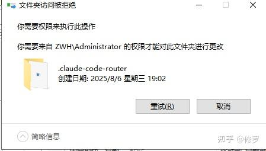

## 一、背景
使用禅道，使用完想要删除，各种限制



## 二、批处理
以管理员身份打开命令提示符：
1. 搜索“cmd”，右键“命令提示符”，选择“以管理员身份运行”。
2. 导航到文件夹所在目录，使用cd命令。例如，如果文件夹在C盘的某个路径下：cd C:\路径\到\文件夹的父目录。
3. 授予所有权：输入 takeown /f 文件名 /r /d y 并回车。（这会将所有权转移到当前管理员。）
4. 授予权限：输入 icacls 文件名 /grant 用户名:F /t 并回车。（授予管理员完全控制权。）
5. 删除文件夹：输入 rd /s /q 文件名 并回车。（/s 删除子目录和文件，/q 安静模式不提示。

## 三、批处理自动化
```bat
@echo off
echo 正在获取所有权...
takeown /f "D:\ZenTao" /r /d y

echo 正在授予权限...
icacls "D:\ZenTao" /grant admin:F /t

echo 正在删除文件夹...
rd /s /q "D:\ZenTao"

echo 完成！
pause
```
