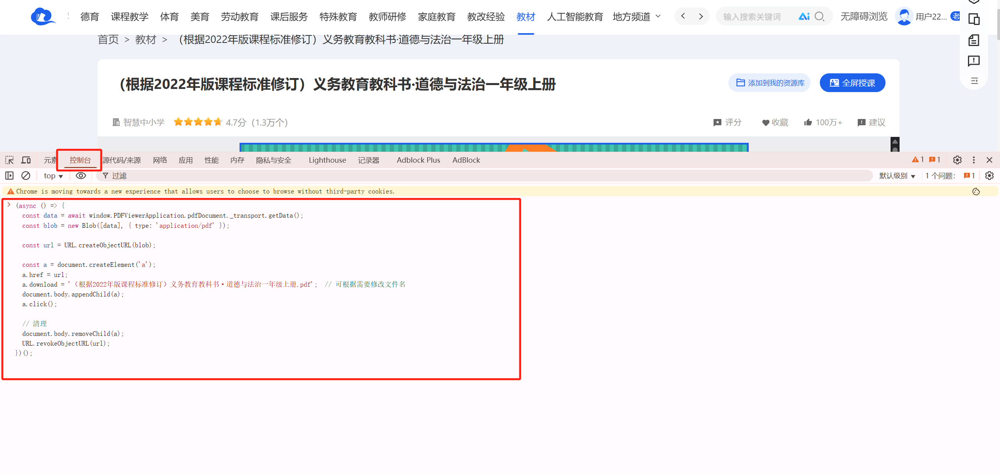

# 【最新教程(2025)】如何下载国家中小学智慧教育平台教材资源（图文，超简单）
## 前言
本教程仅用于技术交流，请遵守相关法律法规，下载资源后请于24小时内删除，支持正版。

## 原理
web网页预览的时候，pdf.js内部其实已经加载了整个文件的数据，只要获取到blob数据，下载就好了 (萌新，有不对的地方欢迎大佬指正)


## 直接下载
### 步骤：国家中小学智慧教育平台教材，打开要下载的资源


提供资源搜索技巧（如 site:example.com filetype:pdf）

## 步骤2：打开F12, 控制台粘贴代码，修改文件名称，并执行
```javascript

(async () => {
  const data = await window.PDFViewerApplication.pdfDocument._transport.getData();
  const blob = new Blob([data], { type: 'application/pdf' });

  const url = URL.createObjectURL(blob);

  const a = document.createElement('a');
  a.href = url;
  a.download = '（根据2022年版课程标准修订）义务教育教科书·道德与法治一年级上册.pdf';  // 可根据需要修改文件名
  document.body.appendChild(a);
  a.click();

  // 清理
  document.body.removeChild(a);
  URL.revokeObjectURL(url);
})();

```


