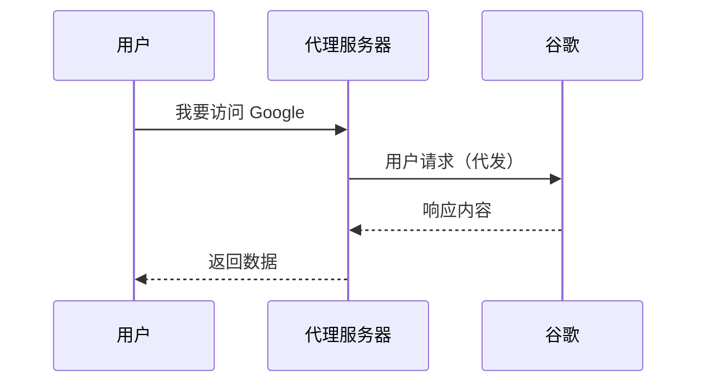
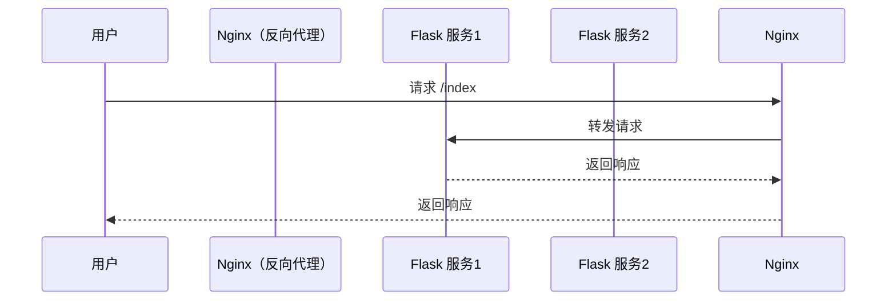

# 🛰️ 正向代理 vs 反向代理（通俗理解）

## 📌 概念对比表

| 项目           | 正向代理                     | 反向代理                     |
|----------------|------------------------------|------------------------------|
| 谁发起使用？     | 客户端（用户自己配置）         | 服务端（自动代理到后端）     |
| 被隐藏的是谁？   | 客户端                        | 后端服务器                   |
| 应用场景        | 科学上网、绕过墙              | 负载均衡、隐藏真实后端       |
| 示例            | VPN、HTTP代理                 | Nginx、Apache 反向代理       |
| 用户访问的是什么 | 代理服务器                    | 代理服务器                   |
| 代理服务器转发给 | 目标网站                      | 实际后端服务（如 Flask）     |

---

## 🎯 正向代理（Forward Proxy）

> **帮你访问你访问不到的网站**



### 🔍 特点
- 客户端配置代理
- 代理“伪装”你去访问外部
- 被服务端看到的是“代理”，不是你

### 🛠 用途
- 科学上网
- 绕过防火墙
- 限制 IP 访问（如只允许代理服务器的 IP）

---

## 🎯 反向代理（Reverse Proxy）

> **帮用户访问后端真实服务，用户不知道背后有几个 Flask**



### 🔍 特点
- 用户不配置任何代理
- 用户访问的是 Nginx，但真正处理请求的是后端服务（Flask、Django）
- 后端服务被“隐藏”了起来

### 🛠 用途
- 动静分离（Nginx 提供静态文件）
- 负载均衡（分发请求到多个后端）
- 提供 HTTPS 支持（SSL 终止）
- 统一入口（网关）

---

## 📦 一个经典例子（Flask + Nginx）

```text
[用户浏览器]
     │
     ▼
 [Nginx 反向代理]
     │    ├── 静态资源直接返回
     │    └── 动态请求 → Gunicorn → Flask
```

---

## ✅ 小结一句话

> 正向代理隐藏的是**客户端**，反向代理隐藏的是**服务端**。
